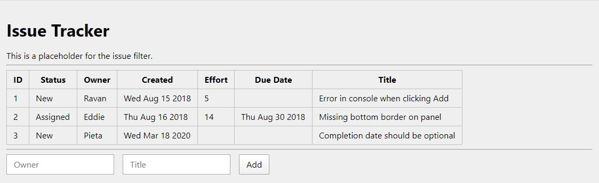

# React Basics

## Setup Nodemon

```
npm i nodemon
```

## Setup Webpack

```
npm i -D webpack webpack-cli
npm i -D babel-loader
```

## Setup Babel for React

```
npm i @babel/core @babel/cli @babel/preset-env
npm i @babel/preset-react
```

## Demo



## References

- [Usage Guide · Babel](https://babeljs.io/docs/en/usage)
- [Pro MERN Stack Full Stack Web App Development with Mongo, Express, React, and Node](https://www.apress.com/gp/book/9781484243909)
- [Code Listing for the book Pro MERN Stack ](https://github.com/vasansr/pro-mern-stack)

## Refactoring Tools

- [ES7 React/Redux/GraphQL/React-Native snippets](https://marketplace.visualstudio.com/items?itemName=dsznajder.es7-react-js-snippets)
- [VSCode React Refactor](https://marketplace.visualstudio.com/items?itemName=planbcoding.vscode-react-refactor)
- [Setting up Prettier and ESlint for JS and React Apps](https://medium.com/dubizzletechblog/setting-up-prettier-and-eslint-for-js-and-react-apps-bbc779d29062)
